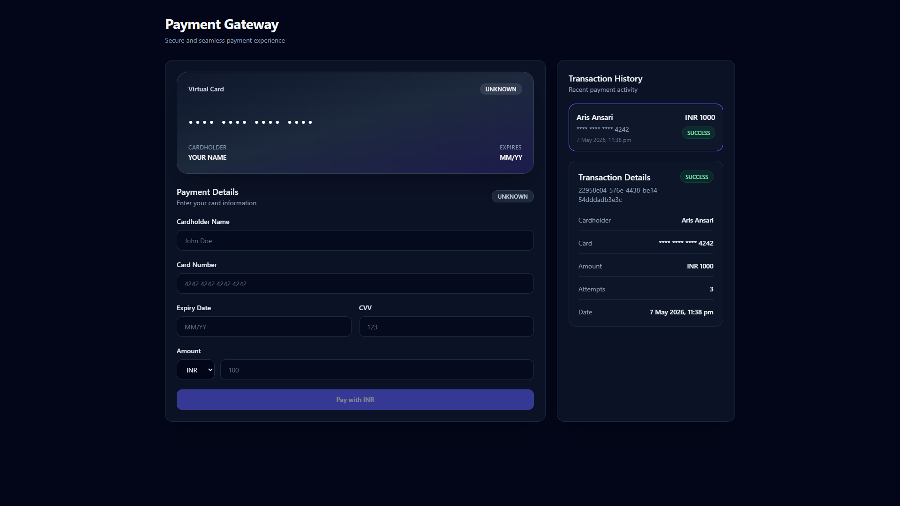
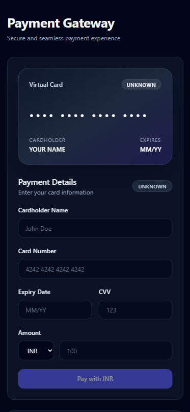
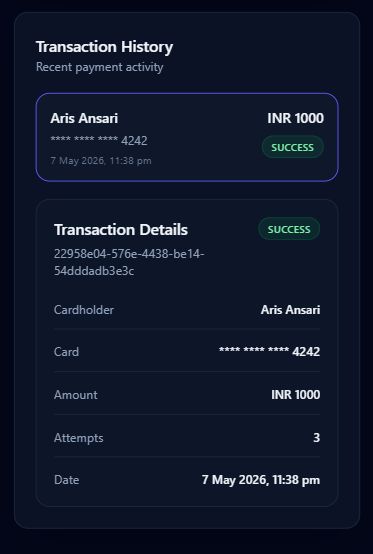

# Payment Gateway UI

Production-ready fintech-inspired payment gateway UI built with Next.js App Router, TypeScript, Zustand, React Hook Form, Zod, and Tailwind CSS.
The project focuses on scalable frontend architecture, resilient payment lifecycle handling, reusable UI systems, and production-quality user experience patterns.

## Live Demo

[Live Application](https://payment-gateway-bay.vercel.app/)

## Repository

[GitHub Repository](https://github.com/aris-ansari/payment-gateway)

---

## Screenshots

### Desktop



### Mobile





---

# Features

## Payment Experience

- Real-time payment form validation
- Card formatting and card type detection
- Live card preview
- Currency selection (INR / USD)
- Accessible form inputs
- Responsive fintech-inspired UI

---

## Payment Lifecycle

- Mock payment gateway API
- Success / failure / timeout states
- AbortController timeout handling
- Loading and processing states
- Retry payment functionality
- Retry attempt tracking
- Idempotent retry flow using same transaction ID

---

## Transaction Management

- Zustand global state management
- Persistent transaction history using localStorage
- Transaction details dashboard
- Selected transaction state
- Status badges and timestamps

---

## Engineering & Architecture

- Scalable folder structure
- Reusable UI components
- Clean TypeScript types
- Business logic separated from UI
- Service layer abstraction
- Utility-first architecture
- Responsive design
- Accessibility improvements

---

# Key Highlights

- Built with Next.js App Router and TypeScript
- Implemented AbortController timeout handling
- Designed scalable Zustand state architecture
- Added idempotent retry payment flow
- Persistent transaction history with localStorage
- Responsive fintech-inspired UI system
- Production-focused component architecture

---

# Tech Stack

- Next.js App Router
- TypeScript
- Tailwind CSS
- Zustand
- React Hook Form
- Zod
- Lucide React

---

# Folder Structure

```txt
src/
├── app/           # App Router pages and API routes
├── components/    # Reusable UI and feature components
├── constants/     # Shared constants
├── hooks/         # Custom React hooks
├── lib/           # Shared utilities and storage helpers
├── services/      # API and business services
├── store/         # Zustand global store
├── types/         # Shared TypeScript types
├── utils/         # Formatting and validation helpers
```

---

# Getting Started

## Install dependencies

```bash
npm install
```

## Run development server

```bash
npm run dev
```

Open:

```txt
http://localhost:3000
```

---

# Payment Simulation

The mock payment API simulates:

- Successful payments
- Failed payments
- Timeout scenarios

Timeout handling is implemented using AbortController.

---

# Retry Logic

- Failed and timeout payments can be retried
- Retry attempts are tracked
- Same transaction ID is reused for retries
- Maximum retry attempts enforced

---

# Deployment

Deployed on Vercel.

---

# Design Direction

The UI follows a modern fintech-inspired design system with:

- Dark premium dashboard aesthetic
- Indigo/electric blue accents
- Responsive layouts
- Accessible contrast ratios
- Soft shadows and rounded surfaces
- Minimal and production-focused styling

---

# Future Improvements

- Advanced input masking with cursor preservation
- Real payment gateway integration
- Unit and integration testing
- Authentication and user accounts
- Analytics dashboard
- Multi-currency conversion support

---

# Author

Aris Ansari